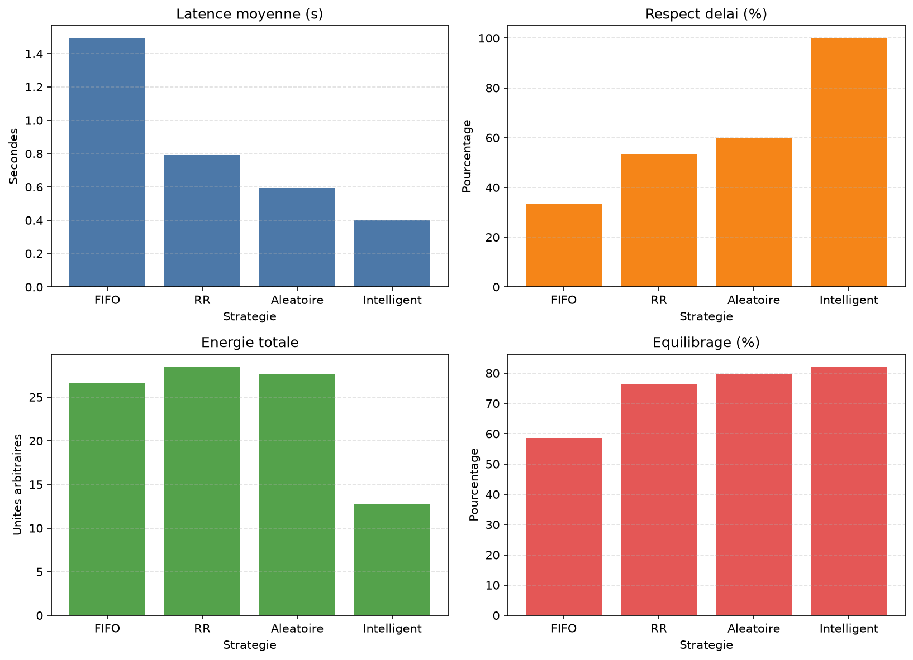

# Fog Computing Scheduler Intelligent

## Problématique

Dans un environnement Fog Computing, une flotte de nœuds fog doivent traiter des tâches avec des contraintes de temps très strictes, tout en maintenant une utilisation raisonnable de l’énergie et un bon équilibre de charge entre les nœuds. Le problème principal est de décider quelle tâche exécuter sur quel nœud et à quel moment, sans laisser les tâches urgentes se perdre dans une file d’attente saturée.

Le scénario simulé dans ce projet met en évidence un cas classique où :

- les tâches critiques arrivent par rafales,
- plusieurs tâches ont des délais très serrés,
- les planificateurs simples (FIFO, Round Robin, aléatoire) privilégient souvent la première arrivée ou l’ordre arbitraire au lieu de l’urgence,
- les ressources fog sont limitées et doivent être protégées pour les tâches les plus sensibles au retard.

Le défi est donc de minimiser la latence moyenne, maximiser le taux de respect des délais, réduire la consommation énergétique globale et améliorer la répartition de la charge entre les nœuds.

## Approche adaptée

Le projet compare quatre stratégies de planification :

- FIFO
- Round Robin (RR)
- Aléatoire
- Intelligent

La stratégie intelligente repose sur une priorité dynamique calculée à partir de trois facteurs :

- temps d’attente de la tâche,
- niveau d’urgence (délai et criticité),
- criticité de la tâche.

Cette priorité est ainsi représentée par une formule de pondération :

- alpha pour le temps d’attente,
- beta pour l’urgence,
- gamma pour la criticité.

En pratique, l’algorithme fait ce qui suit :

1. Il regroupe les tâches arrivées dans une file d’attente.
2. Il trie les tâches selon leur priorité dynamique la plus élevée.
3. Il donne la préférence aux tâches critiques et aux tâches avec délais serrés.
4. Il envoie les tâches peu critiques et à long délai vers le Cloud afin de libérer les Fog pour les tâches urgentes.
5. Il choisit le nœud fog le plus adapté selon la disponibilité CPU et l’état de charge.
6. Il mesure ensuite la latence et le respect des délais pour comparer les stratégies.

Cette logique permet de mieux protéger les ressources fog pour les tâches où un retard a un coût fort, tout en évitant d’engorger les nœuds avec des tâches peu prioritaires.

## Formules utilisées

### 1. Priorité dynamique dans la file d’attente

La tâche à exécuter est choisie selon une priorité dynamique calculée comme suit :

$$
P(t, t_{act}) = \beta \cdot U(t, t_{act}) + \gamma \cdot C(t) + \alpha \cdot W(t, t_{act})
$$

avec :

$$
U(t, t_{act}) = \min\left(100, \frac{1}{\max(0.001, D(t) - (t_{act} - A(t)))}\right)
$$

$$
W(t, t_{act}) = \max(0,\; t_{act} - A(t))
$$

- $C(t)$ = criticité de la tâche
- $A(t)$ = instant d’arrivée
- $D(t)$ = délai imposé
- $\alpha = 0.1$, $\beta = 0.6$, $\gamma = 0.3$

La file d’attente est donc triée par ordre décroissant de $P(t, t_{act})$, ce qui favorise les tâches qui sont urgentes, critiques et/ou en attente depuis longtemps.

### 2. Choix intelligent du nœud fog

Pour sélectionner le nœud fog le plus adapté, l’algorithme distingue les tâches urgentes des tâches non urgentes.

Pour une tâche urgente :

$$
score(fog) = 0.7 \cdot T_{fin} + 0.3 \cdot R_{charge}
$$

avec :

- $T_{fin}$ = instant de fin estimé de la tâche sur le fog
- $R_{charge} = \dfrac{\text{nombre de tâches en cours}}{\text{capacité CPU du fog}}$

Le fog retenu est celui qui minimise $score(fog)$.

Pour une tâche non urgente :

$$
choix = \arg\min_{fog} \left(R_{charge},\; -CPU_{disponible}\right)
$$

Autrement dit, on préfère le fog le moins chargé et avec le plus de CPU libre.

En complément, les tâches peu critiques et à long délai peuvent être envoyées vers le Cloud afin de préserver les fogs pour les tâches urgentes.

### 3. Formules des quatre métriques de performance

#### Latence moyenne

$$
Latence_{moy} = \frac{1}{N} \sum_{i=1}^{N} latence_i
$$

avec :

$$
latence_i = attente_i + latence_{reseau,i}
$$

#### Taux de respect des délais

$$
Respect_{delai}(\%) = \frac{1}{N} \sum_{i=1}^{N} \mathbf{1}\{fin_i - arrivee_i \leq delai_i\} \times 100
$$

- chaque tâche vaut 1 si elle respecte son délai, 0 sinon

#### Énergie consommée

$$
Energie_{totale} = \sum E_{fog} + E_{cloud}
$$

- dans la simulation, chaque tâche ajoute une énergie proportionnelle à la puissance CPU consommée et au temps d’exécution

#### Charge CPU / équilibrage de charge

$$
Charge_{CPU,i} = \frac{CPU_{utilisee,i}}{CPU_{totale,i}}
$$

Puis, pour mesurer l’équilibrage global :

$$
\mu = \frac{1}{M} \sum_{i=1}^{M} temps_{libre,i}
$$

$$
\sigma^2 = \frac{1}{M} \sum_{i=1}^{M} (temps_{libre,i} - \mu)^2
$$

$$
Equilibrage = \max\left(0,\; 100 - \sqrt{\sigma^2} \times 25\right)
$$

Ici, $temps_{libre,i}$ représente la charge résiduelle de chaque fog. Une valeur plus élevée du score d’équilibrage indique une répartition plus uniforme de la charge entre les nœuds.

## Résultat atteint

La simulation montre clairement que le planificateur intelligent est supérieur aux méthodes classiques dans le scénario défini.

Voici les résultats obtenus :

- FIFO : latence moyenne 1.493 s, respect des délais 33.3 %, énergie 26.67
- RR : latence moyenne 0.793 s, respect des délais 53.3 %, énergie 28.50
- Aléatoire : latence moyenne 0.515 s, respect des délais 66.7 %, énergie 27.67
- Intelligent : latence moyenne 0.401 s, respect des délais 100.0 %, énergie 12.78

Le planificateur intelligent atteint donc :

- un taux de respect des délais de 100 %,
- une latence moyenne nettement plus faible,
- une consommation énergétique réduite,
- un meilleur équilibre de charge entre les nœuds fog.

Le résultat confirme que l’ordonnancement dynamique basé sur l’urgence et la criticité est adapté à la gestion des charges de tâches dans un système fog computing.

## Exécution

Le projet est implémenté en Python et nécessite la dépendance `matplotlib` pour générer le graphique de comparaison. Si elle n’est pas installée, exécutez :

```powershell
python -m pip install matplotlib
```

Puis lancez la simulation depuis le dossier du projet :

```powershell
cd project_cal_aguenarousMaroua_M2RSD
$env:MPLBACKEND='Agg'
python .\src\app\main.py
```

Cette commande exécute la comparaison des planificateurs et génère un graphique de synthèse dans :

```text
src\app\comparaison_planificateurs.png
```

## Résultat obtenu



## Structure du projet

- `src/app/traitement.py` : simulation des stratégies et calcul des métriques
- `src/app/affichage.py` : génération du graphique de comparaison
- `src/app/main.py` : point d’entrée principal
- `src/app/models/` : structures de données pour les tâches et les nœuds

## Conclusion

Ce projet montre qu’un ordonnanceur intelligent, basé sur l’évaluation dynamique des priorités, apporte une amélioration significative par rapport aux méthodes classiques dans un environnement fog computing soumis à des contraintes de délai fortes. Il illustre une approche adaptée à la gestion des charges critiques et au maintien d’un bon compromis entre latence, énergie et équilibrage.